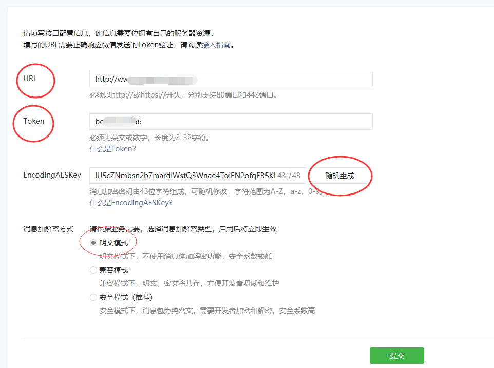
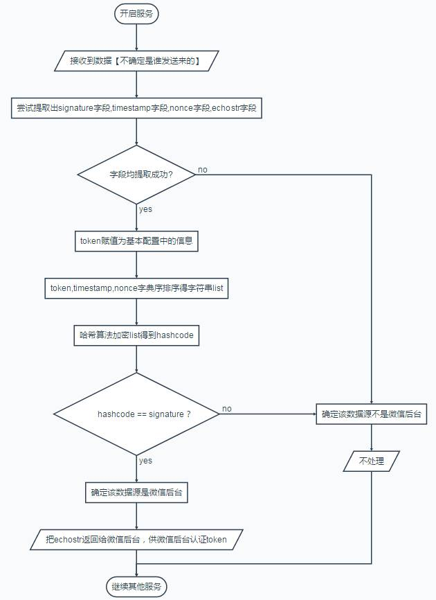
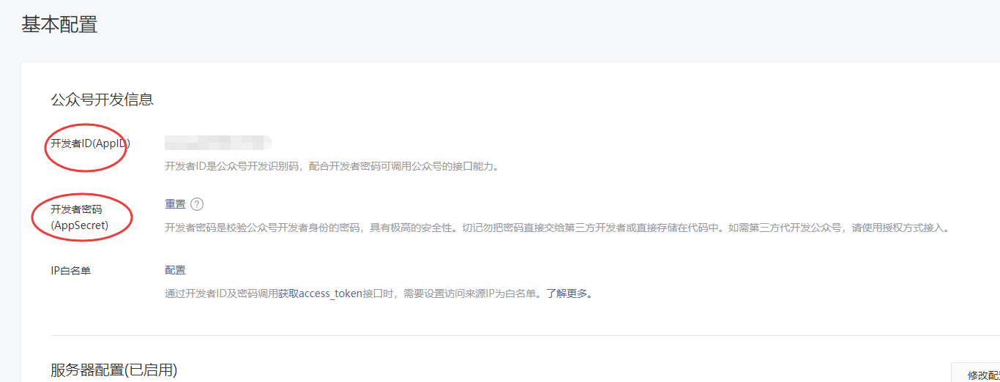
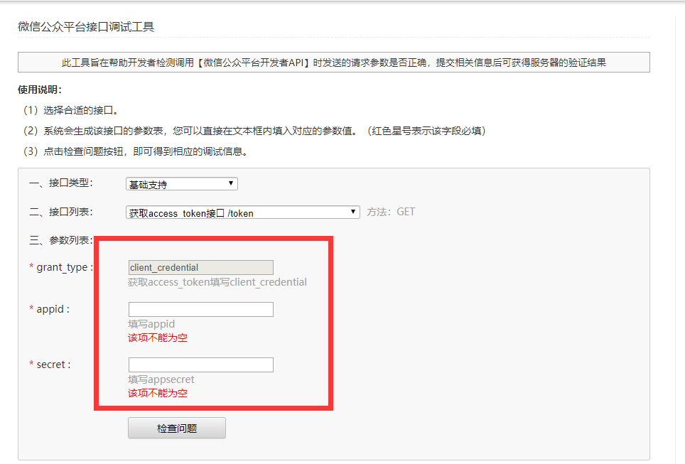
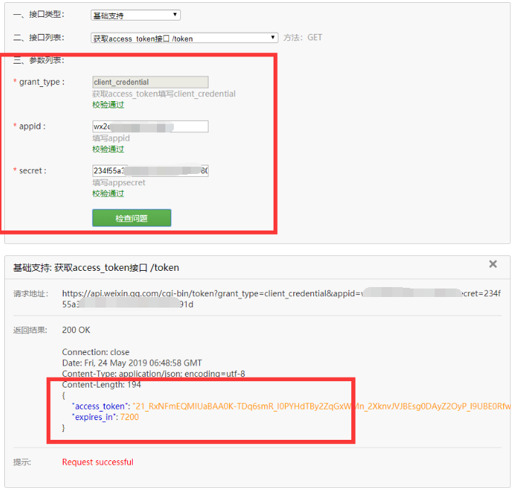
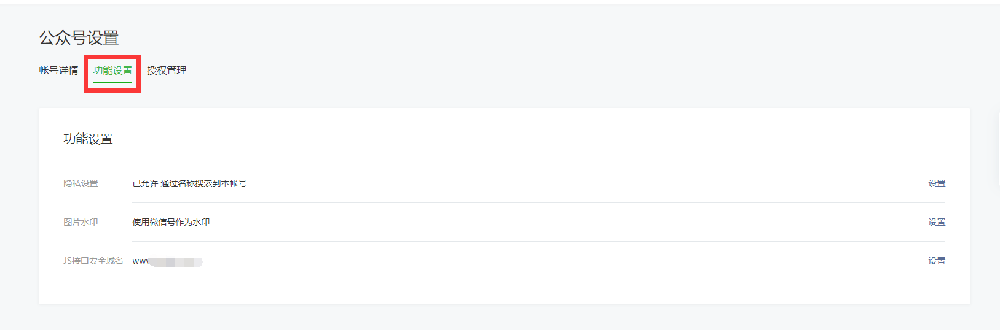
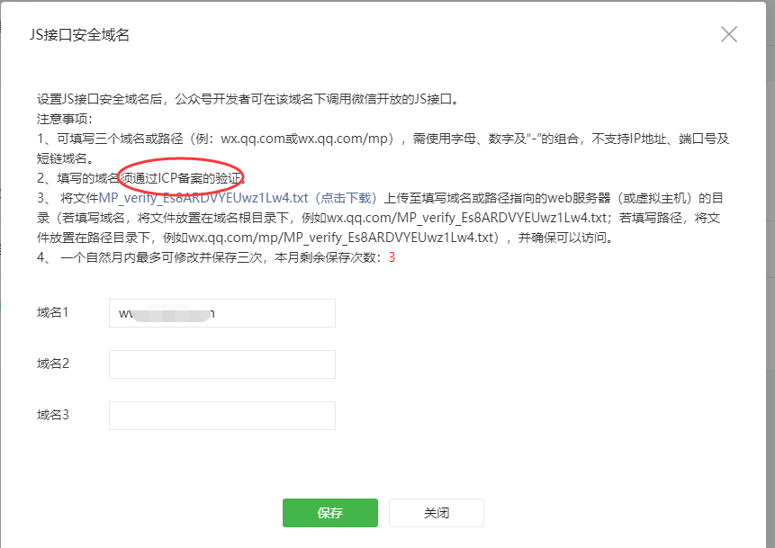

### 前期准备工作

[TOC]

#### 1、开启公众号开发者模式

##### 1.1 申请公众号

微信的开发者文档真的有点丈二和尚摸不着头脑，有点让人迷糊。

做微信公众号开发，先注册微信公众号，最好有一个**服务器**和一个**备过案的域名**，不然很多jsapi接口无法调试。

一般情况下，个人注册订阅号，企业注册企业号。


##### 2.2 开发者配置

公众平台官网登录之后，找到“`基本配置`”菜单栏


这里的服务器配置，是*微信*发请求到你所填写的`服务器地址`去验证你是这个==公众号==的开发者的。

> url填写：`http://外网IP`。外网IP。嗯嗯http的端口号固定使用80，不可填写其他。

> Token：自主设置，这个token与公众平台wiki中常提的*access_token*不是一回事。这个token只用于验证开发者服务器。
>
> 
>
> 消息加解密密钥随机生成即可
>
> 消息加密模式，开发环境选择明文即可

如果服务器端没有，提交肯定提示失败，或者出现错误。

我是自己有个域名，然后用`Nodejs + Express`写了一个接口：

> api/auth.js

```javascript
// 第一步认证为开发者
const crypto = require('crypto');
const config = require('../config');


// 微信认证开发者  微信服务器发送请求到你的服务器，做校验，参数都是微信传过来的。
module.exports = auth = (req, res) => {

  //1.获取微信服务器Get请求的参数 signature、timestamp、nonce、echostr
  var signature = req.query.signature,//微信加密签名
    timestamp = req.query.timestamp,//时间戳
    nonce = req.query.nonce,//随机数
    echostr = req.query.echostr;//随机字符串

  //2.将token、timestamp、nonce三个参数进行字典序排序
  // 这里的 config.token 就是上面你自定义的 Token (如：beip***6666)
  var array = [config.token, timestamp, nonce];
  array.sort();

  //3.将三个参数字符串拼接成一个字符串进行sha1加密
  var tempStr = array.join('');
  const hashCode = crypto.createHash('sha1'); //创建加密类型 
  var resultCode = hashCode.update(tempStr, 'utf8').digest('hex'); //对传入的字符串进行加密

  //4.开发者获得加密后的字符串可与signature对比，标识该请求来源于微信
  if (resultCode === signature) {
    res.send(echostr);
  } else {
    res.send('mismatch');
  }
};
```

这块的逻辑流程图如下：




> 
> 使用Express搭建你的restfull api服务
>
> app.js

```javascript
const express = require('express');
const api = require('./api');
const path = require('path');
const app = express();
const port = 3000;

// 这里就是你的认证路由
app.get('/', (req, res) => {
  api.auth(req, res);
});

// listen
app.listen(port, () => {
  console.log(`Server started on localhost:%d`, port);
});
```

一般你要把你的Node项目升级到你的服务器；

其实就是当做服务器和你的电脑一样就行了，一样要先装一个`nodejs`(如果不会，可以参考之前的教程，[Node项目线上部署](../CentOs配置/Node项目线上部署.md)), 然后一样启动就行了，比如:

```javascript
node app.js
```
这样就启动你项目，`http://你的外网ip:3000`;

不过微信规定端口必须是80，如果上一步你的port 可以设置80最好，如果不可以的，只能考虑用 Nginx 走下反向代理。

假设以上问题都解决了。

访问 `http://你的外网ip`，如果浏览器打印了`mismatch`，说明这个路由走通了

这时候你再回到服务器设置这里，点击按钮，就会提示成功。

那么恭喜你，开始了万里长征的第一步。

#### 2、AccessToken

> 切记，这是继续开发下去的一个重要步骤，缺少这个访问令牌，一切都将不能进行。

`access_token`是公众号的全局唯一接口调用凭据，公众号调用各接口时都需使用`access_token`。开发者需要进行妥善保存。`access_token`的存储至少要保留`512`个字符空间。`access_token`的有效期目前为`2个小时`，需定时刷新，重复获取将导致上次获取的`access_token`失效。

公众平台的API调用所需的`access_token`的使用及生成方式说明：

> 1、建议`公众号开发者`使用`中控服务器`统一`获取和刷新access_token`，其他业务逻辑服务器所使用的`access_token`均来自于该中控服务器，不应该各自去刷新，否则容易造成冲突，导致`access_token`覆盖而影响业务；
>
> 2、目前`access_token`的有效期通过返回的`expire_in`来传达，目前是`7200秒`之内的值。中控服务器需要根据这个有效时间提前去刷新新`access_token`。在刷新过程中，中控服务器可对外继续输出的老`access_token`，此时公众平台后台会保证在`5分钟内，新老access_token都可用，这保证了第三方业务的平滑过渡`；
>
> 3、`access_token`的有效时间可能会在未来有调整，所以中控服务器不仅需要内部定时主动刷新，还需要提供被动刷新`access_token`的接口，这样便于业务服务器在API调用获知`access_token`已超时的情况下，可以触发`access_token`的刷新流程。

公众号和小程序均可以使用`AppID`和`AppSecret`调用本接口来获取`access_token`。`AppID`和`AppSecret`可在“微信公众平台-开发-基本配置”页中获得（需要已经成为开发者，且帐号没有异常状态）。**调用接口时，请登录“微信公众平台-开发-基本配置”提前将服务器IP地址添加到IP白名单中，点击查看设置方法，否则将无法调用成功。**小程序无需配置IP白名单。



**接口调用请求说明**

```
https请求方式: GET
https://api.weixin.qq.com/cgi-bin/token?grant_type=client_credential&appid=APPID&secret=APPSECRET
```

**参数说明**

| 参数       | 是否必须 | 说明                                  |
| :--------- | :------- | :------------------------------------ |
| grant_type | 是       | 获取access_token填写client_credential |
| appid      | 是       | 第三方用户唯一凭证                    |
| secret     | 是       | 第三方用户唯一凭证密钥，即appsecret   |

**返回说明**

正常情况下，微信会返回下述JSON数据包给公众号：

```
{"access_token":"ACCESS_TOKEN","expires_in":7200}
```

**参数说明**

| 参数         | 说明                   |
| :----------- | :--------------------- |
| access_token | 获取到的凭证           |
| expires_in   | 凭证有效时间，单位：秒 |

错误时微信会返回错误码等信息，JSON数据包示例如下（该示例为AppID无效错误）:

```
{"errcode":40013,"errmsg":"invalid appid"}
```

**返回码说明**

| 返回码 | 说明                                                         |
| :----- | :----------------------------------------------------------- |
| -1     | 系统繁忙，此时请开发者稍候再试                               |
| 0      | 请求成功                                                     |
| 40001  | AppSecret错误或者AppSecret不属于这个公众号，请开发者确认AppSecret的正确性 |
| 40002  | 请确保grant_type字段值为client_credential                    |
| 40164  | 调用接口的IP地址不在白名单中，请在接口IP白名单中进行设置。（小程序及小游戏调用不要求IP地址在白名单内。） |

可以在线调试：






`access_token `是很多微信接口的必传参数，所以这一步很重要。

#### 3、JS接口安全域名

这个设置很重要，微信只允许在`JS接口安全域名`下调试所有开发的`JS接口`；

如果是`正式公众号`的开发，这个域名只能是备案过的域名；





如果是`测试公众号`，这里就随意，可以是本地server;

这里需要注意的是，填写格式，如`wx.qq.com`