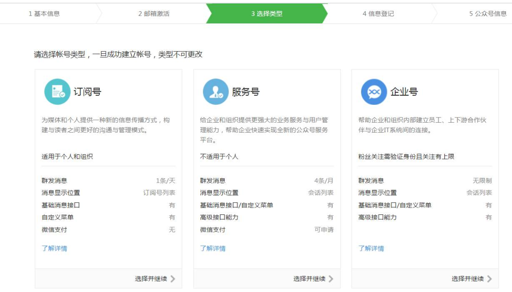
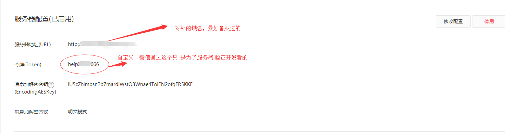

### 前期准备工作

[TOC]

#### 1、开启公众号开发者模式

##### 1.1 申请公众号

微信的开发者文档真的有点丈二和尚摸不着头脑，有点让人迷糊。

做微信公众号开发，先注册微信公众号，最好有一个**服务器**和一个**备过案的域名**，不然很多jsapi接口无法调试。

一般情况下，个人注册订阅号，企业注册企业号。

##### 2.2 开发者配置

公众平台官网登录之后，找到“基本配置”菜单栏

