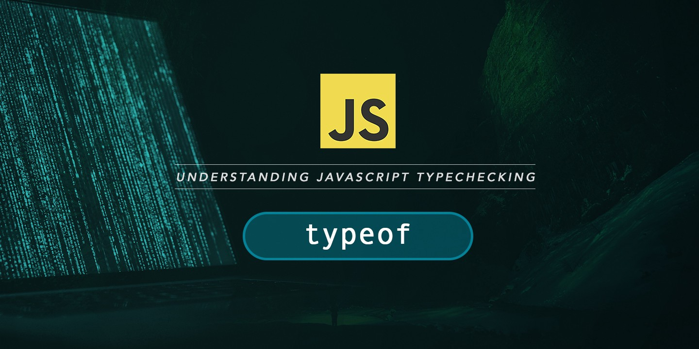
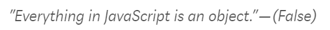
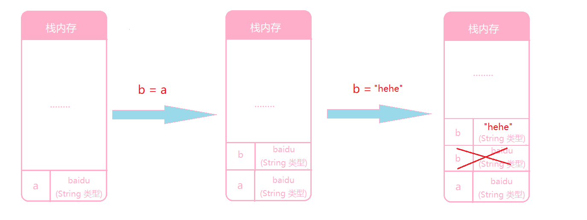
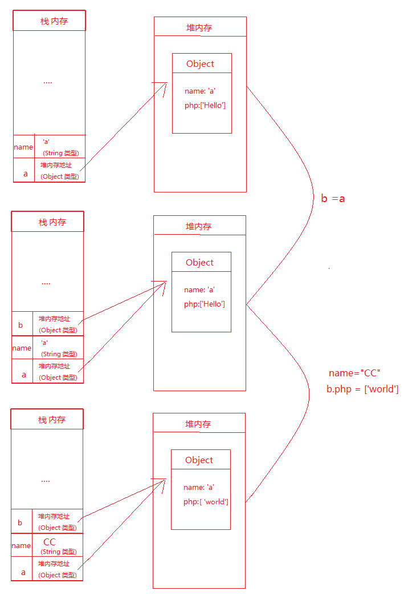

最近一直在面试，却很少总结，反思了一下，这是不应该的。所以打算认真写一下。

**先说下笔试题**

#### Q1:

关于基本类型和==typeof==, 问的还是挺偏的

```javascript
// number
typeof NaN
// number
typeof 12
// string
typeof "12"
// object
typeof null
// undefined
typeof undefined
// object
typeof Date
// object
typeof {a:1}
// object
typeof [1]
// function
typeof function(){}
// true
null == undefined
// false
NaN == NaN
```

类型判断这块的东西，比较基础，却容易混乱，接下来让我们深层次了解下这个东西。



既然是数据类型判断，无可避免需要先说一下，==基本类型==有哪几种：

* String 
* Number
* null
* undefined
* Boolean
* Symbol(Es6)

这六个属于基本数据类型，当然除此之外还有 ==Object== 这个属于引用类型。对象类型是有名字和键值的一个组合。

看到这里我们不禁会问，==arrays==、==functions==、==regular expressions==、==Date==、==Error==等等又算什么。它们只是特殊的Object.

**Example**

```javascript
console.log(typeof ""); // "string"
console.log(typeof "hello"); // "string"
console.log(typeof String("hello")); // "string"
console.log(typeof new String("hello")); // "object"

console.log(typeof 0); // "number"
console.log(typeof -0); // "number"
console.log(typeof 0xff); // "number"
console.log(typeof -3.142); // "number"
console.log(typeof Infinity); // "number"
console.log(typeof -Infinity); // "number"
console.log(typeof NaN); // "number"
console.log(typeof Number(53)); // "number"
console.log(typeof new Number(53)); // "object"

console.log(typeof true); // "boolean"
console.log(typeof false); // "boolean"
console.log(typeof new Boolean(true)); // "object"

console.log(typeof undefined); // "undefined"

console.log(typeof null); // "object"

console.log(typeof Symbol()); // "symbol"

console.log(typeof []); // "object"
console.log(typeof Array(5)); // "object"

console.log(typeof function () {}); // "function"
console.log(typeof new Function); // "function"

console.log(typeof new Date); // "object"

console.log(typeof /^(.+)$/); // "object"
console.log(typeof new RegExp("^(.+)$")); // "object"

console.log(typeof {}); // "object"
console.log(typeof new Object); // "object"
```

| value                | typeof                        |
| -------------------- | ----------------------------- |
| `undefined`          | `"undefined"`                 |
| `null`               | `"object"`                    |
| `true` or `false`    | `"boolean"`                   |
| all numbers or `NaN` | `"number"`                    |
| all strings          | `"string"`                    |
| all symbols          | `"symbol"`                    |
| all functions        | `"function"`                  |
| all arrays           | `"object"`                    |
| native objects       | `"object"`                    |
| host objects         | *dependent on implementation* |
| other objects        | `"object"`                    |

你或许经常碰到这句话；



这句话其实是在某些点上是错的。

很多人也许会问，那为什么有些不是对象但是我们依然可以如下调用对象的方法呢？

```javascript
// getting length property of the string
(“Hello World!”).length
//   getting the character of the string at index 8
(“Another String”)[8]
//  calling Number.prototype.toFixed() method on the number
(53.12345).toFixed(2) 
```

真实的原因是javascript引擎创造了一个wrapped object 和这个原始语句相对应。

```javascript
// wrapper object: new String("Hello World!")
(new String("Hello World!")).toLowerCase();

// wrapper object: new String("Another String")
(new String("Another String"))[8];

// wrapper object: new Number(53.12345)
(new Number(53.12345)).toFixed(2);
```

再次说下类型比较，==null== 和 ==[]==通过==typeof== 判断都返回 ==object==， 此时我们怎么样才能进行深层次的区分呢？

##### 比较精确的类型比较，大概要通过下面几种方法

* instanceof operator

* checking the constructor property of the object

* 使用 toString() 方法检查类型.
  

  #### Checking for null

  ```javascript
  function isNull(val){
  	return val === null
  }
  
  console.log(undefined == null); // true
  console.log(undefined === null); // false
  ```

  #### Checking for NaN

  NaN是一个计算导致的结果，一般没有实质意思。前面说过 typeof NaN = number 如果想进一步区分，可以通过 isNaN 或者 es6的 Number.isNaN()

  ```javascript
  typeof NaN //number
  
  console.log(isNaN(NaN)); // true
  console.log(isNaN(null)); // false
  console.log(isNaN(undefined)); // true
  console.log(isNaN(Infinity)); // false
  
  console.log(Number.isNaN(NaN)); // true
  console.log(Number.isNaN(null)); // false
  console.log(Number.isNaN(undefined)); // false
  console.log(Number.isNaN(Infinity)); // false
  ```

  

  最终用法,兼容es6：

```javascript
Number.isNaN = Number.isNaN || (function(value) {
  return value !== value;
})
```

#### 	Checking for arrays

```javascript

// METHOD 1: constructor property
// Not reliable
function isArray(value) {
  return typeof value == 'object' && value.constructor === Array;
}

// METHOD 2: instanceof
// Not reliable since an object's prototype can be changed
// Unexpected results within frames
function isArray(value) {
  return value instanceof Array;
}

// METHOD 3: Object.prototype.toString()
// Better option and very similar to ES6 Array.isArray()
function isArray(value) {
  return Object.prototype.toString.call(value) === '[object Array]';
}

// METHOD 4: ES6 Array.isArray()
function isArray(value) {
  return Array.isArray(value);
}
```

其实最常用的 Object.prototype.toString.call(data) 是很有用的（apply也可以）。不过我们可以封装一下：

```javascript
function type(value){
	const regex = /^\[object (\S+?)\]$/;
	const matches = Object.prototype.toString.call(value).match(regex) || [];
	return (matches[1] || "undefined").toLowerCase();
}
```

**Example**

```javascript
console.log(type('')); // "string"
console.log(type('hello')); // "string"
console.log(type(String('hello'))); // "string"
console.log(type(new String('hello'))); // "string"

console.log(type(0)); // "number"
console.log(type(-0)); // "number"
console.log(type(0xff)); // "number"
console.log(type(-3.142)); // "number"
console.log(type(Infinity)); // "number"
console.log(type(-Infinity)); // "number"
console.log(type(NaN)); // "number"
console.log(type(Number(53))); // "number"
console.log(type(new Number(53))); // "number"

console.log(type(true)); // "boolean"
console.log(type(false)); // "boolean"
console.log(type(new Boolean(true))); // "boolean"

console.log(type(undefined)); // "undefined"

console.log(type(null)); // "null"

console.log(type(Symbol())); // "symbol"
console.log(type(Symbol.species)); // "symbol"

console.log(type([])); // "array"
console.log(type(Array(5))); // "array"

console.log((function() { return type(arguments) })()); // "arguments"

console.log(type(function() {})); // "function"
console.log(type(new Function)); // "function"

console.log(type(class {})); // "function"

console.log(type({})); // "object"
console.log(type(new Object)); // "object"

console.log(type(/^(.+)$/)); // "regexp"
console.log(type(new RegExp("^(.+)$"))); // "regexp"

console.log(type(new Date)); // "date"
console.log(type(new Set)); // "set"
console.log(type(new Map)); // "map"
console.log(type(new WeakSet)); // "weakset"
console.log(type(new WeakMap)); // "weakmap"
```

#### Q2:

考察**变量作用域**

```javascript
var name = "Hello body";
var a = {
	name: "A",
	sayHi: function(){
		console.log(this.name)
	}
};
var b = {
	name: 'B'
};
var sayHi = a.sayHi;
name = "Hello C";

//依次写出返回值
console.log(name);//Hello C
// 此时 this 指向仍是 a
a.sayHi();// A
// 此时 this 指向是 window 也就是全局变量 name
sayHi(); // Hello C
// 改变 this 指向 b
a.sayHi.call(b);// 'B'

```

这应该是个大部分面试都会问的问题吧。

##### 

搞笑一下，言归正传，继续。

#### Q3:

考察 **栈(Stack) && 堆(Heap)**

```javascript
let name = "a";
const a = {
  name: name,
  php: ['Hello']
}
const b = a;
name = "CC";
b.php = ['world'];

/**
* a = b = {name: 'a', php: [world]}
*/
console.log(a)
console.log(b)
```

**Stack**

存储有顺序的数据，所以存储 variables和指向堆内存中的该对象的指针



**heap**

无序存储数据，放置 objects




#### Q4:

**trim 实现方法？**

```javascript

```

#### Q5:

**请把“my-name-is-andy”变成驼峰格式？**

```javascript

```

#### Q6:

**执行以下代码，会发送什么，又如何改进？**

```javascript
const spans = document.getElementsByTagName('span');// 5个
for(var i=0; i< spans.length; i++){
	spans[i].onclick = function(){
		alert(i)
	}
}
console.log(i)//5
/**
结果是 点击任何一个span 都是 alert(5)
var i = 0 其实是一个全局变量，整个循环结束后 i == spans.length 依然存在
*/

// 改进1 var 更改为 let，这样 i 就是一个当前代码块里的一个局部变量
for(let i=0; i< spans.length; i++){
	spans[i].onclick = function(){
		alert(i)
	}
}
console.log(i)// Uncaught ReferenceError: i is not defined


// 使用闭包  closure functon 这样就避免了最后只读 i
for(let i=0; i<spans.length;i++){
  spans[i].onclick = (function(n){
    return function(){
      alert(n)
    }
  })(i)
}

```

#### Q7:

**写出s6的几种用法**

```javascript

```


### 下是面谈的问题

#### Q8:

**Vue 生命周期实现过程？**

```

```


#### Q9:

**vuex中 mumation 和 action 有什么不同？ 实现原理是什么？**

```

```


#### Q10：

**vue v-if 和 v-show 的区别？ Key的作用？**

```

```


#### Q11:

**vue keep-alive 用法？**


#### Q12:

**vue router 如何返回和刷新？**


#### Q13：

**Vue 框架特点**


#### Q14 

**es6 箭头函数**


#### Q15:

**bind 和 call apply 区别**


#### Q16:

**Promise 和 async await 区别？**


#### Q17:

移动端适配

```

```

